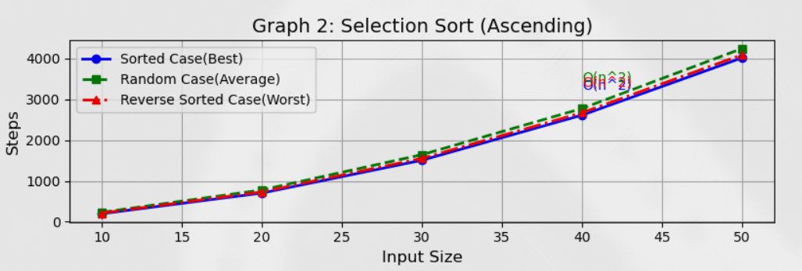
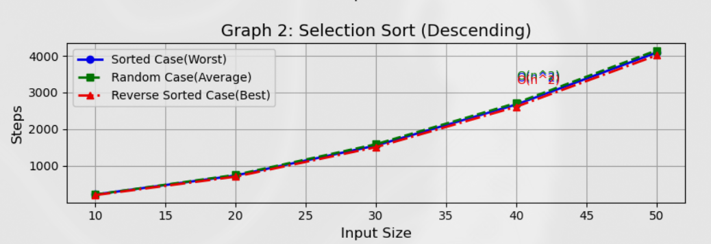
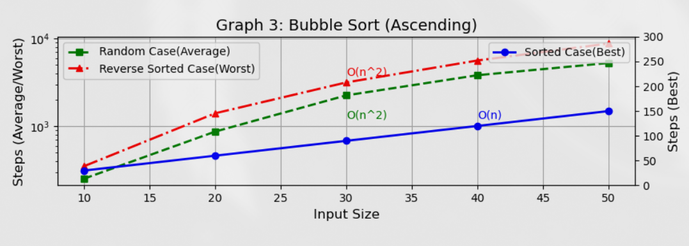
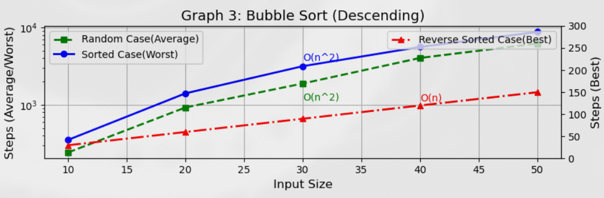
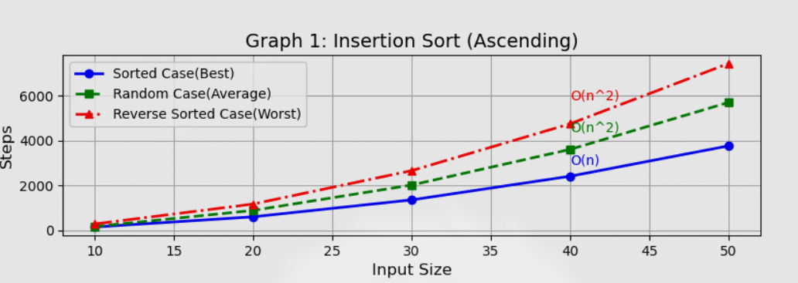
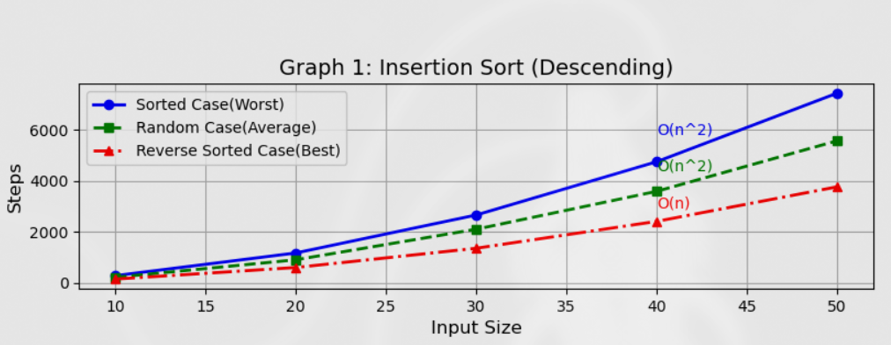

# Sorting Algorithms Analysis
### Here, I have analysed Selection Sort, Bubble Sort and Insertion Sort algorithms with the Step Counting method and then plotted the results for different input size vs steps counted in graphs for both ascending and descending order sorting.
# How to run in your system
To run the source code, you will need the C++ compiler and build utilities installed and set up on your machine. You can install these using the appropriate package managers for your operating system. For example, on Linux, you can use `apt`, `yum`, or similar, while on macOS you can use Homebrew. On Windows, you can install the MinGW or MSVC toolchains. Make sure the compiler is added to your system's PATH.

You will also need to have Python installed and set up on your machine to run the Python script to visualize the graphs. To get Python, either use a package manager or check out https://python.org/downloads/ for installation.

You also need matplotlib to visualize the graphs. You can get it by running `pip install matplotlib` in your terminal for a global matplotlib install, or you can set up a virtual environment and then install it. You can also use any other system package manager to install matplotlib if your machine uses a global package manager to keep things in sync.

Clone the repository with:

```bash
git clone https://github.com/Anurag97659/sorting-algo-analysis
```

Navigate to the sorting-algo-analysis directory:

```bash
cd sorting-algo-analysis
```

Compile the C++ source code using your C++ compiler. For example, if you are using `g++`, run:

```bash
g++ -o sorting_analysis sorting_analysis.cpp
```

Run the compiled program:

```bash
./sorting_analysis
```

When prompted, press `y` and enter the number of items you want in the array, followed by the array elements separated by spaces. Press Enter to get your full analysis.

To get the graphs, run the Python script:

```bash
python sorting_graph.py
```

# Sorting Algorithm Step Count Analysis

## Output for Selection Sort

### Ascending Order:
```
Step Count Analysis for Ascending Order:
---------------------------------------------------------------------
| Input Size | Sort Case Steps | Rev. Sort Case Steps | Random Case Steps |
---------------------------------------------------------------------
|         10 |             198 |             213 |                222 |
|         20 |             703 |             733 |                751 |
|         30 |            1508 |            1553 |               1586 |
|         40 |            2613 |            2673 |               2721 |
|         50 |            4018 |            4093 |               4156 |
```

 
### Descending Order:
```
---------------------------------------------------------------------
| Input Size | Sort Case Steps | Rev. Sort Case Steps | Random Case Steps |
---------------------------------------------------------------------
|         10 |             213 |             198 |                207 |
|         20 |             733 |             703 |                760 |
|         30 |            1553 |            1508 |               1580 |
|         40 |            2673 |            2613 |               2721 |
|         50 |            4093 |            4018 |               4159 |
```

## Output for Bubble Sort

### Ascending Order:
```
Step Count Analysis for Ascending Order:
---------------------------------------------------------------------
| Input Size | Sort Case Steps | Rev. Sort Case Steps | Random Case Steps |
---------------------------------------------------------------------
|         10 |              30 |             351 |                290 |
|         20 |              60 |            1406 |                988 |
|         30 |              90 |            3161 |               2446 |
|         40 |             120 |            5616 |               3749 |
|         50 |             150 |            8771 |               6064 |
```

### Descending Order:
```
Step Count Analysis for Descending Order:
---------------------------------------------------------------------
| Input Size | Sort Case Steps | Rev. Sort Case Steps | Random Case Steps |
---------------------------------------------------------------------
|         10 |             351 |              30 |                217 |
|         20 |            1406 |              60 |                983 |
|         30 |            3161 |              90 |               2156 |
|         40 |            5616 |             120 |               4141 |
|         50 |            8771 |             150 |               6520 |
```

## Output for Insertion Sort

### Ascending Order:
```
Step Count Analysis for Ascending Order:
---------------------------------------------------------------------
| Input Size | Sort Case Steps | Rev. Sort Case Steps | Random Case Steps |
---------------------------------------------------------------------
|         10 |             155 |             290 |                212 |
|         20 |             610 |            1180 |                955 |
|         30 |            1365 |            2670 |               1989 |
|         40 |            2420 |            4760 |               3674 |
|         50 |            3775 |            7450 |               5554 |
```

### Descending Order:
```
Step Count Analysis for Descending Order:
|         10 |             290 |             155 |                203 |
|         20 |            1180 |             610 |                847 |
|         30 |            2670 |            1365 |               1983 |
|         40 |            4760 |            2420 |               3509 |
|         50 |            7450 |            3775 |               5284 |
```

## Custom Array Testing
### User Input:
```
Do you want to test a custom array? (y/n): y
Enter the size of the array: 5
Enter 5 elements for the array:
3 1 4 2 5
```

### Output for Ascending Order:
```
Sorting in Ascending Order:
---------------------------
Bubble Sort: Steps = 50, Sorted Array: 1 2 3 4 5
Selection Sort: Steps = 67, Sorted Array: 1 2 3 4 5
Insertion Sort: Steps = 49, Sorted Array: 1 2 3 4 5
```

### Output for Descending Order:
```
Sorting in Descending Order:
----------------------------
Bubble Sort: Steps = 74, Sorted Array: 5 4 3 2 1
Selection Sort: Steps =67, Sorted Array: 5 4 3 2 1
Insertion Sort: Steps = 61, Sorted Array: 5 4 3 2 1
```

### Summary:
```
Step Count Summary for Input Size 5:
-------------------------------------------------
| Algorithm       | Ascending Steps | Descending Steps |
-------------------------------------------------
| Bubble Sort     |             50 |             86 |
| Selection Sort  |             58 |             58 |
| Insertion Sort  |             40 |             40 |
-------------------------------------------------
```


